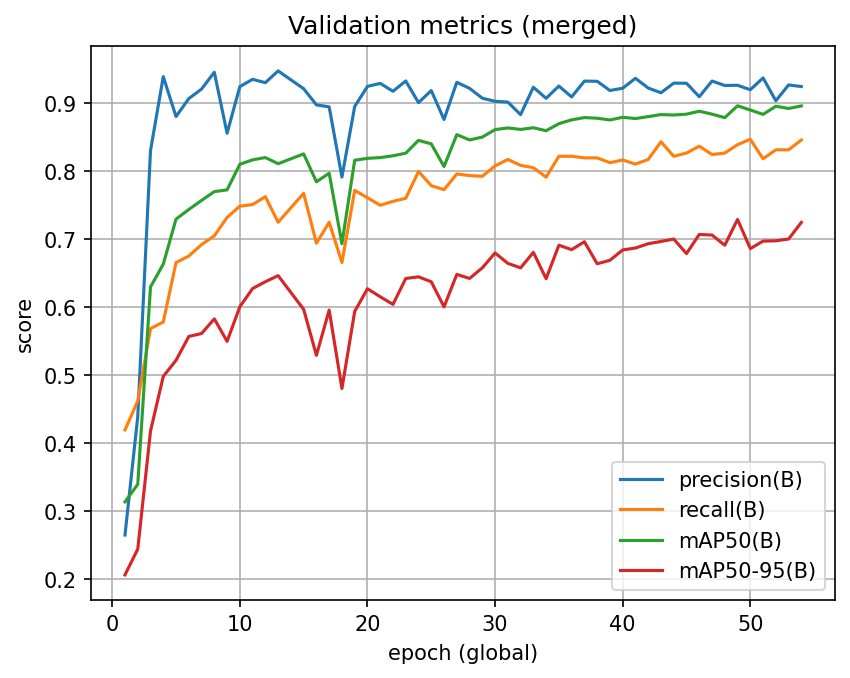

# T‑Bank Logo Detection API

REST‑сервис детекции логотипа **Т‑Банка** (стилизованная «Т» в щите, любой цвет). Логотипы «Тинькофф» считаем **негативами** и игнорируем.

* **Форматы**: JPEG / JPG / PNG / BMP / WEBP
* **Скорость**: ≤ 2 с/изображение
* **Порт**: `8000`
* **Веса**: `weights/best.onnx` (копируются в образ как `/models/best.onnx`)
* **Инференс**: ONNX Runtime (по умолчанию CPU)

---

## Быстрый старт (Docker)

Сборка
```bash
docker build -t tlogo-api-cpu:latest -f Dockerfile .
```
Запуск (используются веса, встроенные в образ как /models/best.onnx)
```bash
docker run --rm -it -p 8000:8000 tbank-api-cpu:latest
```

Проверка:

```bash
curl http://127.0.0.1:8000/healthz
```
{"status":"ok"}
```bash
curl.exe -s -X POST "http://127.0.0.1:8000/detect" -F "file=@demo/test_2logo.jpg"
```
{"detections":[{"bbox":{"x_min":...,"y_min":...,"x_max":...,"y_max":...}}]}

ENV по умолчанию (можно переопределить при запуске):

* `MODEL_PATH=/models/best.onnx`
* `CONF_THRES=0.55`
* `IOU_THRES=0.50`
* `IMG_SIZE=960`
* `ORT_INTRA_THREADS=4`, `ORT_INTER_THREADS=1`

---

## API

Реализованы эндпоинты:

* `GET /healthz` — статус
* `POST /detect` — приём изображения, возврат абсолютных координат `bbox` в контракте из `server/schemas.py`

Интерактивная документация: `/docs` (Swagger) и `/redoc` включены. Контракт строго соответствует заданию.

---

## Структура репозитория

```
sirius_cv/
├── server/                    # REST API + инференс
│   ├── app.py                 # маршруты и валидация
│   ├── inference.py           # препроцесс → ORT → постпроцесс (NMS, clip)
│   ├── schemas.py             # Pydantic модели ответа/ошибок
│   └── utils.py               # letterbox, NMS, преобразования
├── data/
│   ├── merged_tlogo/          # итоговый YOLO‑датасет (train/valid/test)
│   ├── interim/auto_owlvit/   # автолейблы OWLv2 (images/labels)
│   ├── annotations/{coco,yolo}
│   ├── raw/  sample/  sample2/
├── training/
│   ├── configs/               # (yaml и пр.)
│   └── scripts/
│       ├── 00_sample_random.py        # отбор случайных изображений
│       ├── 01_auto_annotate.py        # zero‑shot автолейблинг (OWLv2)
│       ├── 02_download_rf_dataset.py  # загрузка датасетов Roboflow
│       └── 02_find_iou.py             # свип IoU/NMS на валидации
├── docker/Dockerfile
├── weights/                   # best.onnx (не хранится в гите)
└── test.py                    # утилита для экспорта дерева и содержимого проекта
```

---

## Данные

* **Орг‑датасет**: архив с неразмеченными изображениями (см. инструкцию в ноутбуке/скриптах). Парольный архив распаковывался в `data/raw`.
* **Zero‑shot автолейблинг**: `training/scripts/01_auto_annotate.py` (OWLv2) на части сырых данных $\to$ YOLO‑txt в `data/interim/auto_owlvit`.
* **Негативные примеры**: кадры без T‑Bank, в т.ч. с логотипом «Тинькофф», включались как **пустые** файлы разметки (hard negatives).
* **Сводный набор**: `data/merged_tlogo/{train,valid,test}` (YOLO‑формат). Датасет можно скачать [тут](https://universe.roboflow.com/siriuscv/merged_tlogo-v3wlr/dataset/1 "Roboflow"). Сплиты фиксированы.
* **Состав датасета**: ~8k изображений, ~25% фото содержит лого, `train/val/test = 70/20/10%` и стратифицирован по наличию логотипа, без аугментаций
---

## Как я обучал модель
Ниже все мои реальные действия

0. **Zero‑shot автолейблин**: Сначала я попробовал по рекомендации из задания попробовать zero-shot подход. Выбрал `Owlv2`, тк он показывает хорошие резы на бенчмарках, но прогнав 100 изображений понял, что в этой задаче он не подходит тк много FP

1. **Старт: 500 ручных аннотаций в Roboflow**
   Для быстрого старта разметил \~500 изображений с критериями класса: только «Т в щите», цвет любой. Логотипы «Тинькофф» оставлялись **без** боксов (как негативы).

2. **Первая модель в Roboflow (YOLOv11 Fast)**
   Обучил быструю конфигурацию прямо в RF для быстрого цикла обратной связи. На их валидации: *mAP\@50 ≈ 94%*, *Precision ≈ 96.8%*, *Recall ≈ 89.9%*. Эту модель использовал как teacher для полуавторазметки.

3. **Авторазметка ещё ≈500 изображений**
   В RF разметил еще \~500 с помощью первой модели. [Вот такое](https://app.roboflow.com/siriuscv/tlogo-y3f4d/models) у меня получилось

4. **Попытка локального обучения YOLOv11s в Colab**
   Запустил обучение на суммарно \~1k примерах. Результат оказался хуже RF‑модели: **низкий Recall** на мелких/ракурсных логотипах. Пробовал **оверсемплинг** позитивов — частично помогало, но метрики всё равно колебались на уровне `P = 0.95, R = 0.75, mAP@50 = 0.80, mAP@95 = 0.45`. что явно не дотягивало до результатов в RF, которые можно достичь

5. **Больше данных**
   Мне в RF случайно попались похожие на мой датасеты (тоже с лого Тбанка) и я расширил исходный набор до **\~8k изображений**. Это резко улучшило покрытие редких кейсов

6. **Балансировка: даунсемплинг train**
   После слияния доля позитивов осталась \~25%, и я подумал, что это тоже сильно влияет на метрики. Я **даунсемплировал train**, чтобы снизить смещение в сторону фонов и ускорить обучение. `val/test` не трогал для честной оценки.

7. **Смена модели на YOLOv11m**
   Увеличил ёмкость модели с `11s` $\to$ `11m`, что дало **лучший Recall** на мелких объектах без критичного падения скорости. Итоговую модель экспортировал в **ONNX** (`weights/best.onnx`).

8. **Подбор постпроцесса (NMS/пороги)**
   Скрипт `training/scripts/02_find_iou.py` использовал для свипа **IoU NMS** на валидации и подбора порогов. Но это практически не дало улучшений. Итоговые параметры в окружении по умолчанию: `CONF_THRES=0.55`, `IOU_THRES=0.50`, `IMG_SIZE=960`.

Итог: на расширенном датасете + `yolov11m` достигнут устойчивый баланс P/R, заметно ниже ложноположительных на «Тинькофф», уверенная работа на разных цветах логотипа.

---

## Валидация и метрики

*  сплиты лежат в `data/merged_tlogo/valid` и `.../test`

* метрики и лоссы


на 17 эпохе сильная просадка, потому что прервал обучение и продолжил с чуть другими параметрами


`Test metrics: precision 0.95 recall: 0.88 mAP50: 0.93 mAP50-95: 0.75`

## Примеры

видите 2 лого? а их тут 3. Модель плохо справляется с маленькими, из-за этого Recall отстает. Зато распознал в отражениии


---

## Производительность

* Инференс на **ONNX Runtime (CPU)** с тюнингом потоков (`ORT_INTRA_THREADS`, `ORT_INTER_THREADS`).
* Препроцесс: `letterbox` до квадрата `IMG_SIZE` без искажения аспекта.
* Постпроцесс: NMS на NumPy, клип координат, ограничение `MAX_DET`.

При наличии GPU можно собрать альтернативный образ с `onnxruntime-gpu` и включить CUDA‑провайдер (минимальные правки в `server/inference.py`).

---

## Известные ограничения

* Очень маленькие логотипы и сильное размытие ухудшают Recall.
* Экстремальные повороты/перевороты встречаются редко и покрыты хуже.

---

## Что можно было бы еще сделать

* Вручную сделать ауги поворота на 90 градусов
* Добавить фото с маленькими лого и дообучить
